<p align="center">
  
</p>

<h1 align="center">Portal</h1>

<p align="center">
  <b>A fast, native launcher and clipboard manager for macOS.</b><br>
  Snippets that know where you are, quicklinks with their own hotkeys, ChatGPT text transformers,<br>
  and an encrypted clipboard history that syncs between your Macs.
</p>

<p align="center">
  
  
  
  <a href="LICENSE"></a>
</p>

<p align="center">
  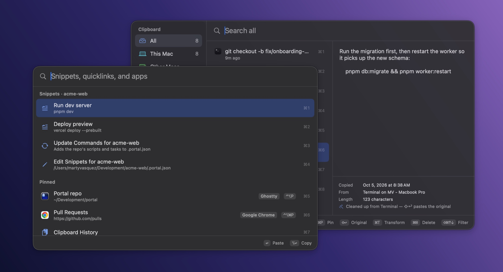
</p>

---

Portal is a menu bar app written in Swift and SwiftUI, with no third-party dependencies. It was
built to replace Raycast with something smaller that does a handful of things well:

- **⌘Space** opens the **launcher**: snippets for the folder, site, or app you're in, quicklinks, apps, a calculator, and AI transformers for the text you've selected.
- **⇧⌘V** opens **clipboard history**, end-to-end encrypted and shared between your Macs through iCloud Drive.

Everything is configured in a real Settings window, stored as plain JSON, and synced without an account or a server.

## Contents

- [Highlights](#highlights)
- [Launcher](#launcher)
  - [Quicklinks](#quicklinks)
  - [Snippets](#snippets)
  - [Calculator](#calculator)
  - [Transformers (ChatGPT)](#transformers)
  - [Open With for Finder](#open-with)
  - [Default results: pinned and recent](#default-results)
- [Clipboard history](#clipboard-history)
- [Sync](#sync)
- [Privacy and security](#privacy-and-security)
- [Install](#install)
- [Settings reference](#settings-reference)
- [Development](#development)
- [FAQ](#faq)
- [License](#license)

## Highlights

| | |
|---|---|
| **Context-aware snippets** | Different snippets for each repo (from a `.portal.json` that travels with git), each website, and each app. Portal reads the folder from Ghostty or Terminal and the page from your browser. |
| **Quicklinks with hotkeys** | Folders and URLs that open in the app you choose (Ghostty, Chrome, Sublime Text…), each with an optional global hotkey. `{query}` links ask for text first. |
| **AI transformers** | Select text anywhere, open the launcher, pick "Polish" or "Summarize". Runs on your ChatGPT Plus/Pro plan; no API key. |
| **Encrypted, synced clipboard** | AES-256-GCM per clip, a passphrase that never leaves your Macs, and sync through iCloud Drive with no merge conflicts. |
| **Secrets handled properly** | API keys, tokens, and password manager copies are detected, masked, and expire sooner. |
| **Terminal copy cleanup** | Copies from terminals lose trailing spaces, box borders, and hard wraps, so they paste cleanly. The original is one key away. |
| **Instant calculator** | Type `(1280 * 0.85) + 42` and the answer is there. |
| **Feels like a Mac app** | SwiftUI, system text styles, keyboard-first everywhere. |

<a id="launcher"></a>
## Launcher

Press **⌘Space**. With nothing typed, the launcher shows what fits where you are, in this order:

1. **Transformers**, when text is selected.
2. **Finder Selection**, when Finder is in front: rows to open what's selected with your Open With apps.
3. **Snippets** for this folder, this site, and this app.
4. **Pinned** rows, in the order you set.
5. **Recent**: what you use most, weighted toward what you used last.

Start typing to search everything: quicklinks, snippets, apps, and Portal's own commands ("settings",
"clipboard", "new quicklink", "quit"). Results you open often and recently rank higher.

<p align="center">
  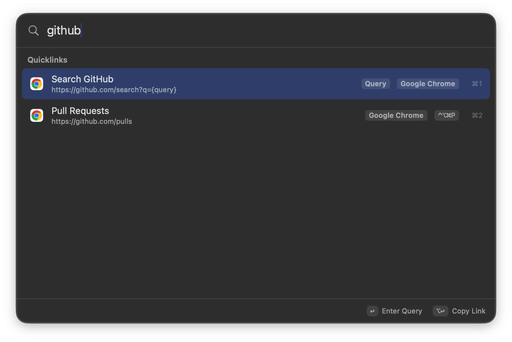
  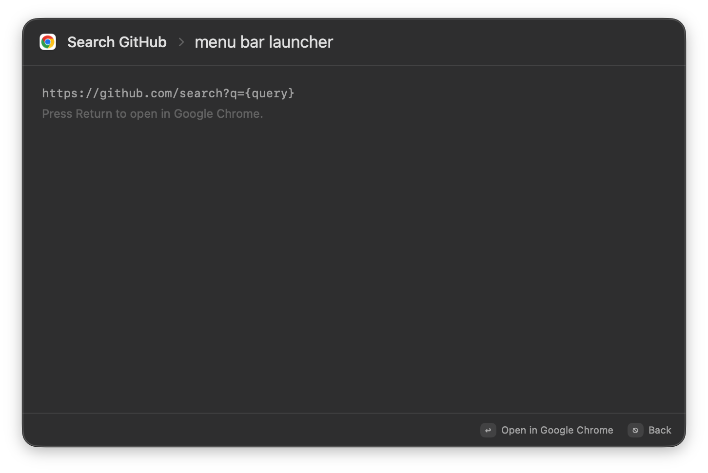
</p>

| Key | Action |
|---|---|
| `↩` | Open, paste, or run the selected row |
| `⌘↩` | Alternate action: a quicklink in the default app (Finder or your browser), an app revealed in Finder |
| `⌥↩` | Copy the link, path, or snippet text |
| `⌘1` to `⌘9` | Pick one of the first nine rows |
| `⌘P` | Pin or unpin the selected row |
| `⇥` | Fill in a `{query}` quicklink |
| `⎋` | Clear the search, then close |

### Quicklinks

**Settings → Quicklinks.** A quicklink is a name, a folder or URL, and the app it opens in, shown
with that app's icon. Each one can have its own **global hotkey**, so `⌃⌥P` can open your main repo in
Ghostty from anywhere.

Put `{query}` in a link (`https://github.com/search?q={query}`) and the launcher asks for text before
opening it. Settings groups quicklinks by the app they open in; drag within a group to reorder them.

Like snippets and transformers, a quicklink can be scoped. Add apps or websites under **Show in** and
it shows at the top of the launcher only there, under that place's heading ("For github.com"), with its
hotkey working only there too. A global quicklink can list places under **Except in** where it stays hidden.

<p align="center">
  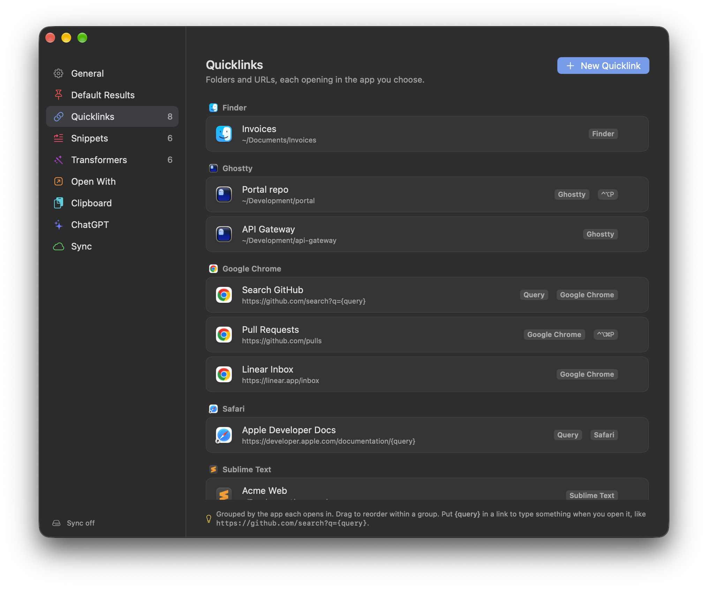
</p>

### Snippets

Snippets are text the launcher pastes into the app you were in. `↩` pastes and then restores your
clipboard; in Finder it copies instead. Each snippet has one of four scopes (a snippet can list both
apps and sites):

| Scope | Where it's defined | Shows when |
|---|---|---|
| **Folder** | `.portal.json` in the repo (travels with git) | a terminal is in front and in that folder or below it |
| **Site** | Settings → Snippets → Show in → Add website | Chrome, Safari, Arc, Brave, or Edge is on a matching page |
| **App** | Settings → Snippets → Show in → Add App | that app is in front |
| **Global** | Settings → Snippets (nothing under Show in) | everywhere except the places under **Except in** |

Site and app snippets show under the place's heading ("For github.com"), after that place's quicklinks.

<p align="center">
  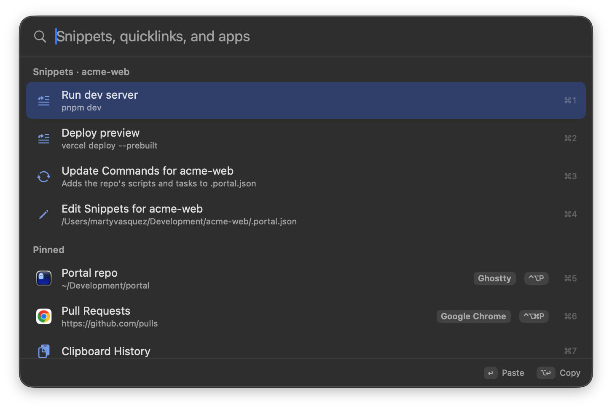
  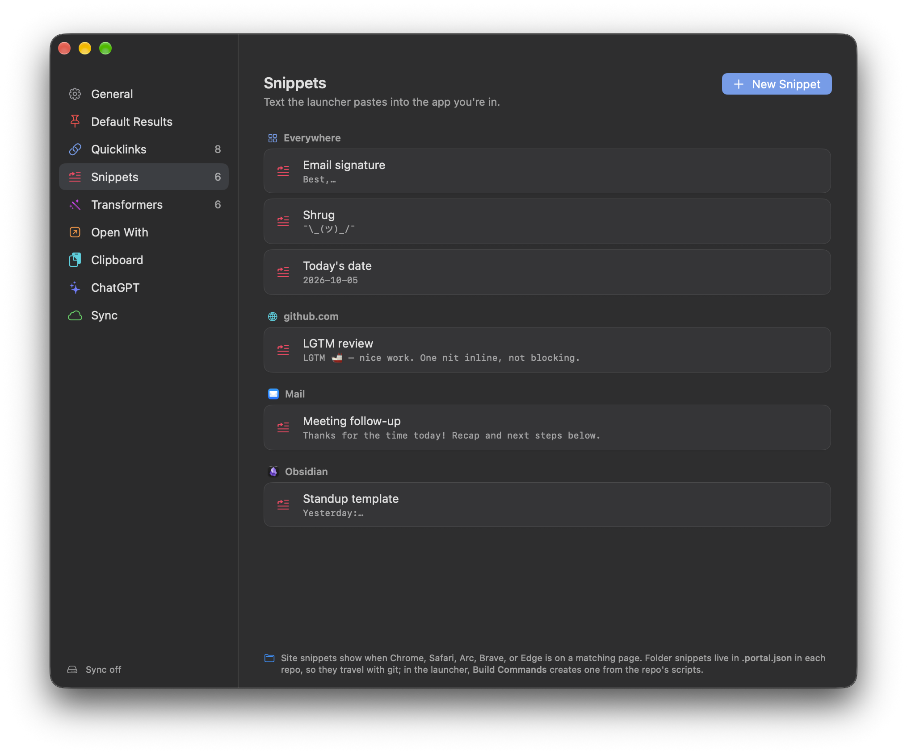
</p>

**How Portal knows the folder** (terminals only; Finder gets [Open With](#open-with) instead):
- **Ghostty**: the focused terminal's working directory, from Ghostty's scripting interface.
- **Terminal**: the front tab's shell directory, found through the tab's tty.

**Site patterns:**
- `github.com` matches the site and its subdomains.
- `*.atlassian.net` matches any subdomain.
- `github.com/your-org` also limits the match to that path.

#### `.portal.json`: snippets that live in the repo

Put a `.portal.json` at the root of a repo. Portal finds it by walking up from the terminal's folder:

```json
{
  "snippets": [
    { "name": "Run dev server", "text": "pnpm dev" },
    { "name": "Deploy preview", "text": "vercel deploy --prebuilt" }
  ],
  "seeded": ["pnpm dev"]
}
```

You don't have to write it by hand. Whenever a terminal is in a folder, the launcher offers **Update Commands**:
- It reads `package.json` scripts, using pnpm, yarn, or bun when that lockfile is present.
- It also reads `Makefile`/`justfile` targets, `scripts/*.sh`, `bin/*`, `Package.swift`, `Cargo.toml`, `project.yml`, and docker compose files.
- It adds new commands to `.portal.json`. After that the file is yours to edit.
- `seeded` records what was added before, so a later update never re-adds a command you deleted and never changes your edits.
- If the file isn't valid JSON, it's left alone and the launcher offers **Fix .portal.json**.

**Edit Snippets** opens the file in your first Open With app for files.

<a id="calculator"></a>
### Calculator

Type math and the answer appears as you type. `↩` pastes the answer (and leaves it on the clipboard);
`⌥↩` only copies it.

<p align="center">
  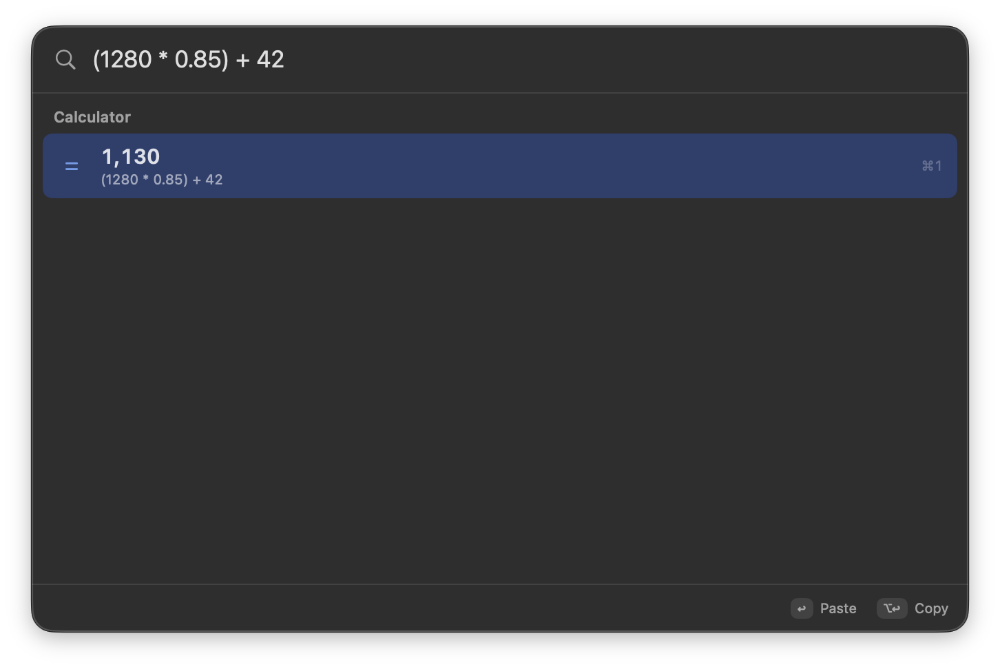
</p>

- Operators: `+` `-` `*` `/` `^` and parentheses. `×`, `x`, `÷`, and `−` work too.
- Percentages work like a calculator: `200 + 15%` is `230`.
- `1,000` is read as one thousand.
- Unfinished input like `4 + 4 + 5 +` shows the answer so far, so it doesn't flicker while you type.

Turn it off in Settings → General → Calculator.

<a id="transformers"></a>
### Transformers (ChatGPT)

**Settings → Transformers.** Transformers are prompts that rewrite the text you've selected, using ChatGPT. Select text in any
app and open the launcher: your transformers come first.

<p align="center">
  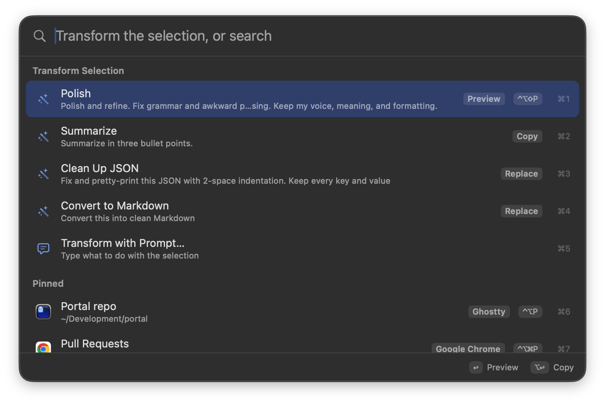
  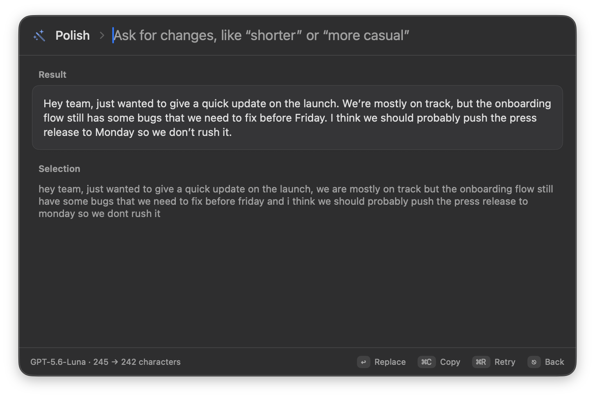
</p>

Each transformer has a name, a prompt like `Polish and refine {selection}`, and what to do with the result:

| When done | What happens |
|---|---|
| **Preview** | The result streams into the launcher. `↩` replaces the selection, `⌘C` copies it, `⌘R` retries. Type a follow-up ("shorter") and press `↩` to revise it. |
| **Replace** | The result is pasted over the selection as soon as it's ready. `⎋` cancels. |
| **Copy to Clipboard** | The result goes on the clipboard (and into clipboard history), and the launcher confirms "Copied to Clipboard" before it closes. |

In the launcher, `⌘↩` previews any transformer and `⌥↩` copies its result, whatever its setting.

- **Prompt variables**: `{selection}`, `{app}` (the app you're in), `{url}` (your browser's page), `{clipboard}`. A prompt without `{selection}` gets the text added at the end.
- **One-off prompts**: type `transform` and your prompt, like `transform translate to Spanish`, and press `↩`. Or pick **Transform with Prompt…**.
- **Where it shows**: by default, on any selected text. Add apps (Mail) or websites (`mail.google.com`) under **Show in** and it shows only there, under its own heading ("For mail.google.com") above the global ones. A global transformer can list places under **Except in** where it stays hidden (say, your terminal).
- **Hotkeys**: give a transformer a hotkey to run it on the selection without opening the list. A scoped transformer's hotkey only works where it shows, so transformers for different places can share one key.
- **Clips**: in clipboard history, `⌘T` runs a transformer on the selected clip. Secrets are never sent.
- **Model**: the newest model your ChatGPT account offers, at low thinking so it's quick. Change it in Settings → ChatGPT, or per transformer.

<p align="center">
  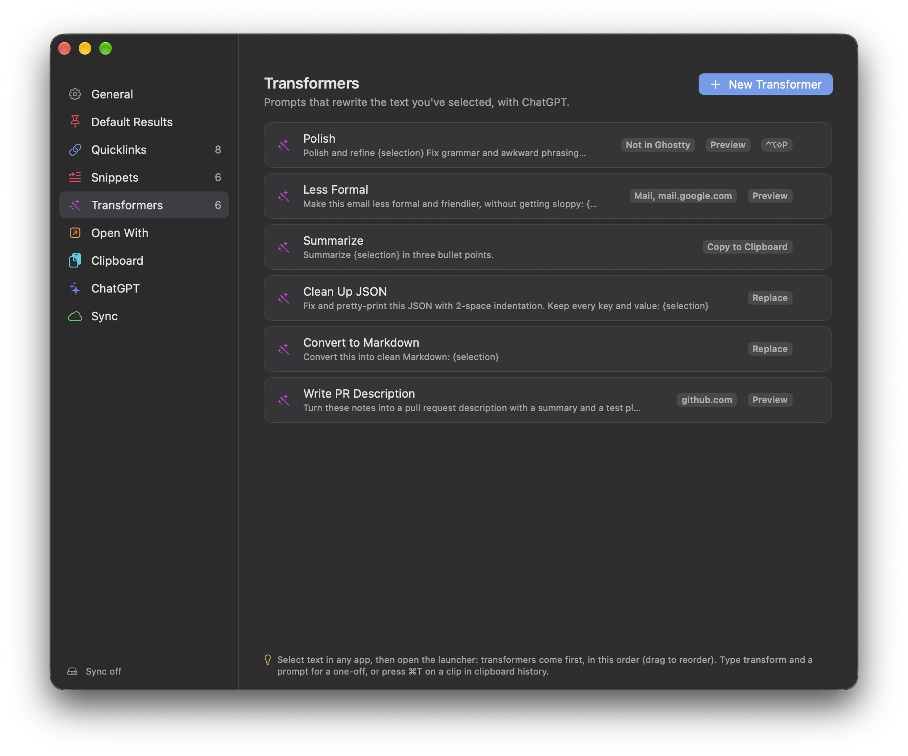
</p>

**Signing in.** Transformers run on your **ChatGPT Plus or Pro** plan through *Sign in with ChatGPT*, so
there's no API key and no per-token billing. In Settings → ChatGPT, click **Continue with ChatGPT** and
approve Portal in your browser. The sign-in is kept in the Keychain of each Mac. Requests are sent with
`store: false`, so OpenAI doesn't keep them.

**How Portal reads the selection.** It asks the app through Accessibility, which works in most Mac apps.
Apps that don't share their selection that way (Chrome, terminals, Electron apps) get their own
Edit ▸ Copy pressed. Portal reads the copied text, puts your clipboard back, and keeps that copy out of
clipboard history. Code editors (Sublime Text, VS Code, JetBrains) copy the cursor's line when nothing
is selected; Portal recognizes that and doesn't offer transformers.

<a id="open-with"></a>
### Open With for Finder

**Settings → Open With.** With Finder in front, the launcher offers apps for whatever is selected.

<p align="center">
  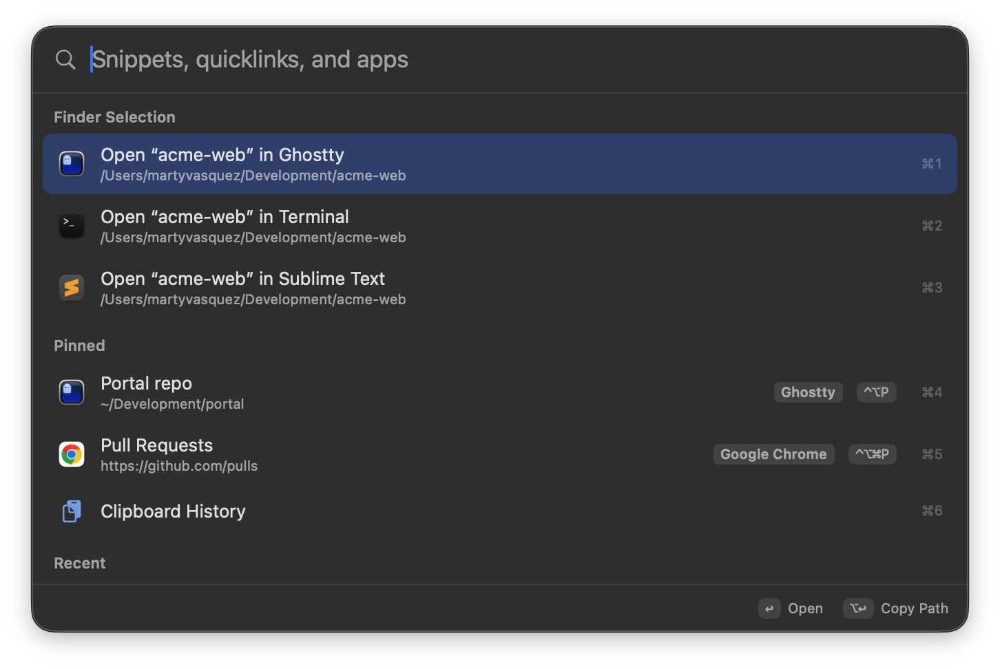
  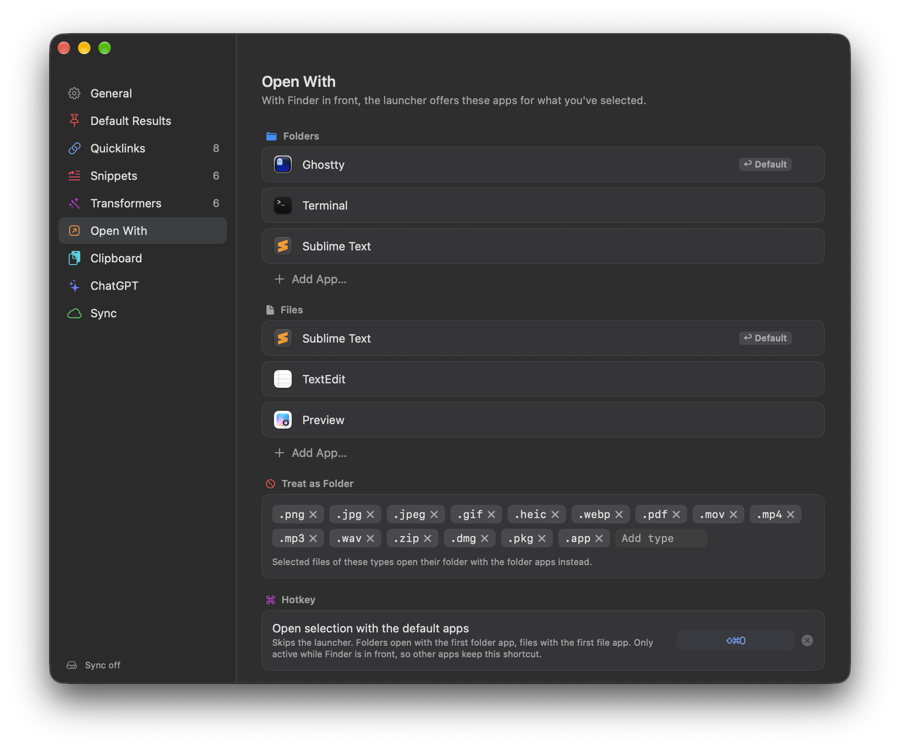
</p>

- **Folders and files** each have their own ordered app list (say, Ghostty → Terminal → Sublime Text for folders). The first is the default.
- **Treat as Folder**: selected files of these types (images, PDFs, archives, `.app`, …) open their folder instead.
- **Hotkey** (optional): opens the selection in the default apps without the launcher. Portal only holds this hotkey while Finder is in front, so the same keys keep working in other apps.

<a id="default-results"></a>
### Default results: pinned and recent

**Settings → Default Results** controls what the launcher shows before you type. Press `⌘P` on any
quicklink, app, global snippet, or command to pin it, and drag pins into order. Below the pins, the
launcher shows your most-used rows: 8 when nothing matches where you are, 3 below rows that do (both adjustable).

<p align="center">
  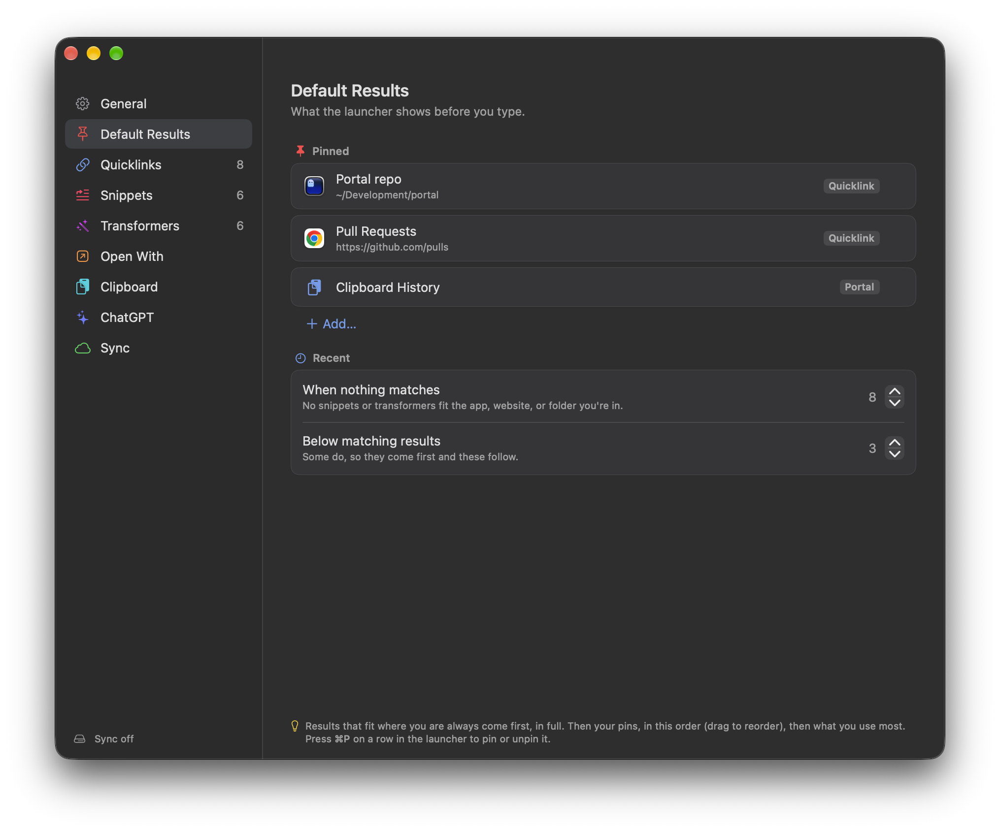
</p>

## Clipboard history

Press **⇧⌘V**. Portal keeps text, links, images, and files for 7 days by default, and shows which app
and which Mac each clip came from.

<p align="center">
  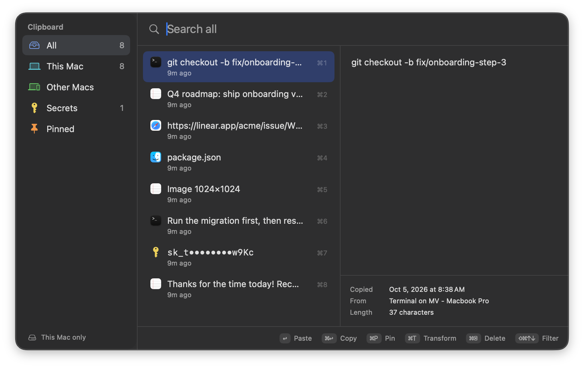
</p>

- **Sidebar filters**: All, This Mac, Other Macs, Secrets, and Pinned.
- **Secrets**: copies from password managers, plus anything that looks like an API key, token, or private key (OpenAI, Stripe, GitHub, AWS, Slack, Google, JWTs, PEM keys, …). They're masked in the list, can expire sooner, and are marked so other clipboard tools skip them.
- **Terminal cleanup**: text copied from Ghostty, Terminal, iTerm, and other terminals is cleaned as you copy it. Trailing spaces, shared indentation, box borders, and Claude Code's `⏺` marker are removed, and wrapped prose is rejoined. Commands and code keep their line breaks. A plain `⌘V` pastes the cleaned text; `⇧↩` in history pastes the original.
- **Images** get a preview; **file** clips list their paths.
- **Plain text only**: clips keep their text, not their formatting.

<p align="center">
  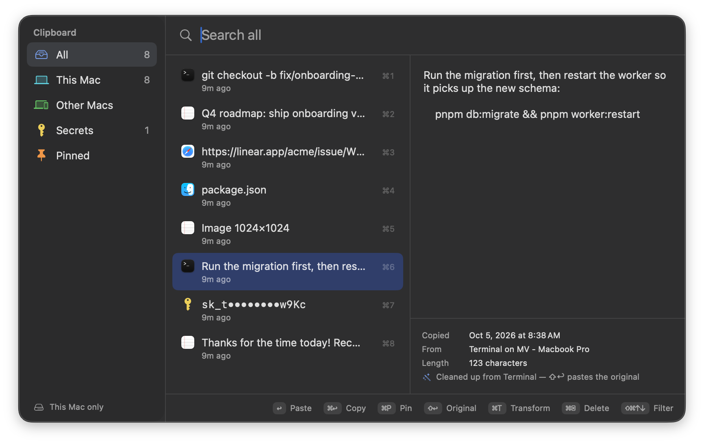
  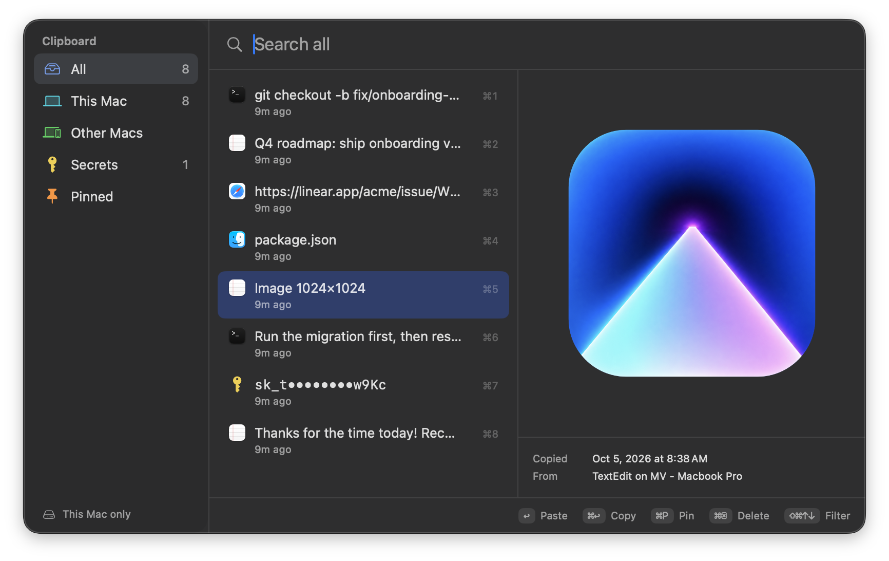
</p>

| Key | Action |
|---|---|
| `↩` / `⌘↩` | Paste into the app you were in / copy only (swappable in Settings) |
| `⇧↩` | Paste the original of a cleaned-up terminal copy |
| `⌘P` | Pin (pinned clips never expire) |
| `⌘R` | Reveal a masked secret |
| `⌘T` | Run a transformer on the clip |
| `⌘⌫` | Delete (on every Mac) |
| `↑` `↓` | Move through clips |
| `⇧⌘↑` `⇧⌘↓` or `⇥` | Move through the sidebar filters |
| `⌘1` to `⌘9` | Paste one of the first nine clips |

## Sync

Turn on **Settings → Sync** on each Mac and use the same folder, by default
`~/Library/Mobile Documents/com~apple~CloudDocs/Portal` in iCloud Drive. Any synced folder works.

| What | How |
|---|---|
| Quicklinks, snippets, transformers, Open With, clipboard settings, hotkeys, model choice | `settings.json` in the sync folder. Polled every few seconds; the last save wins |
| Clipboard history | One AES-256-GCM encrypted file per clip, per Mac. Needs the same passphrase on each Mac |
| Folder snippets | `.portal.json`, committed to each repo, so they sync through git |
| Stays on each Mac | Whether sync is on, open at login, permissions, the passphrase and ChatGPT sign-in (in the Keychain), and launcher ranking |

**How the clipboard files work:**
- Each Mac writes only its own files, `Clipboard/<machine-id>/<ms>_<uuid>_<flags>.clip`, so two Macs never write the same file and there's nothing to merge.
- The pinned and secret flags are part of the filename, so any Mac can delete expired clips without decrypting them.
- `keycheck.json` holds the salt and an encrypted check value, so a wrong passphrase is caught immediately.

## Privacy and security

- **No server, no account, no telemetry.** Portal talks to the network only to sign in to ChatGPT and run your transformers.
- **Clips are always encrypted at rest**, with a random per-Mac key when stored locally or a passphrase-derived key (PBKDF2-SHA256, 600,000 iterations) when synced. The passphrase and keys live in the Keychain and never leave your Macs.
- **Secrets stay local to their purpose.** They're masked in the UI, expire on their own schedule, are never sent to ChatGPT, and are marked `org.nspasteboard.ConcealedType` so other clipboard managers skip them.
- **Ignore apps** under Settings → Clipboard to never record copies from them.
- **Transformer requests** are sent with `store: false`.

### Permissions

| Permission | Why |
|---|---|
| **Accessibility** | Paste into other apps and read the selected text for transformers |
| **Paste from other apps** | macOS asks the first time Portal pastes; choose **Always Allow** |
| **Automation** (Finder, Ghostty, Terminal, your browser) | Read the current folder, Finder selection, or page URL. Nothing else |

## Install

**Download** `Portal.zip` from the [latest release](https://github.com/martyvasquez/portal/releases/latest),
unzip it, and drag `Portal.app` into Applications. The first time you open it, macOS may say it can't
verify the app: click **Done**, then **System Settings → Privacy & Security → Open Anyway**.

**Updates are automatic.** Portal checks for a new release at launch, every four hours, and when the Mac
wakes. It downloads in the background and relaunches on the new version once you haven't used it for a
minute. **Check for Updates…** is in the menu bar menu, and in the launcher.

### Build from source

**Requirements**
- **macOS 26** or later.
- **Full Xcode**, not just the Command Line Tools. On the macOS 27 SDK, SwiftUI's `@State` is a macro whose plugin only ships with Xcode.
- An **Apple Development** signing certificate. A free **Personal Team** is enough; no paid developer account needed. In Xcode → Settings → Accounts, add any Apple ID, select its Personal Team, click **Manage Certificates…**, and add an **Apple Development** certificate. `scripts/build.sh` finds it on its own. Without one the app is signed ad hoc, and macOS forgets Portal's permissions on every rebuild.

```sh
git clone https://github.com/martyvasquez/portal.git
cd portal
sudo xcode-select -s /Applications/Xcode.app/Contents/Developer   # only if Command Line Tools are selected
scripts/build.sh --install
```

This builds a release, signs it, copies `Portal.app` to `/Applications`, and launches it.

To rebuild from your own checkout, pull and build again. In a terminal inside the repo, the launcher offers this as the **Update Portal** snippet:

```sh
git pull && scripts/build.sh --install
```

### First run on each Mac

1. **Free up ⌘Space.** Quit Raycast or Alfred, or turn off the Spotlight shortcut in System Settings → Keyboard → Keyboard Shortcuts → Spotlight. Settings → General warns you if anything still holds it. (Or pick a different launcher hotkey.)
2. **Settings → General → Accessibility → Allow.**
3. If macOS asks whether Portal may paste from other apps, choose **Always Allow**.
4. **Settings → Sync**: enter the **same passphrase** on every Mac.
5. **Settings → ChatGPT**: sign in if you want transformers.
6. Allow Portal to control **Finder, Ghostty, Terminal, and your browser** when macOS asks. If you clicked Don't Allow, change it in System Settings → Privacy & Security → Automation.

<a id="settings-reference"></a>
## Settings reference

<p align="center">
  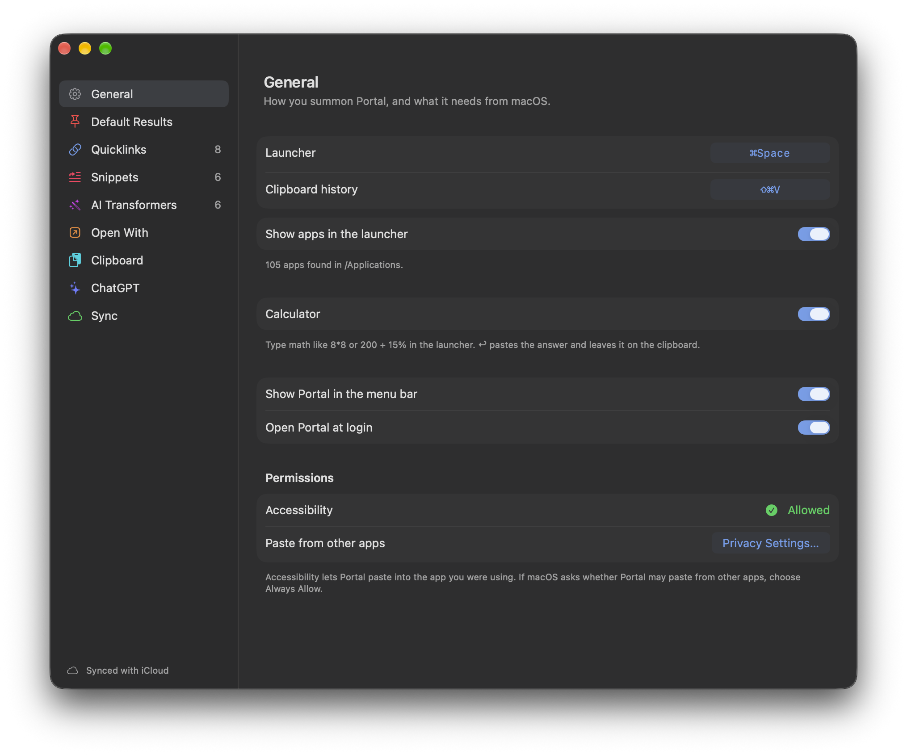
  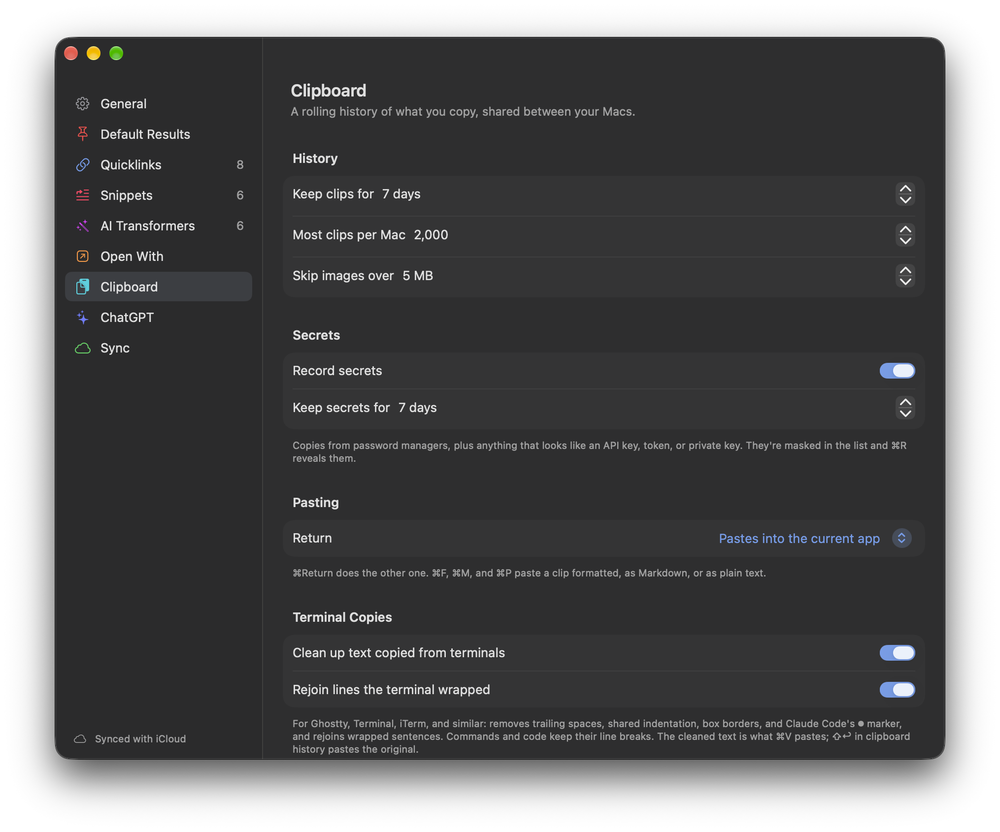
</p>

| Page | What's there |
|---|---|
| **General** | Launcher and clipboard hotkeys, show apps in the launcher, calculator, menu bar icon, open at login, permissions |
| **Default Results** | Pinned rows and how many recent rows to show |
| **Quicklinks** | Your quicklinks, grouped by app, with hotkeys |
| **Snippets** | Global, app, and site snippets |
| **Transformers** | Prompts, actions, scopes, and hotkeys |
| **Open With** | Apps for Finder folders and files, Treat as Folder types, hotkey |
| **Clipboard** | Retention, size limits, secrets, what `↩` does, terminal cleanup, ignored apps |
| **ChatGPT** | Sign in, default model and thinking level, what one-off prompts do |
| **Sync** | Turn on sync, choose the folder, set the passphrase |

While Settings is open, Portal gets a Dock icon and appears in ⌘Tab. If the menu bar icon is hidden,
open Settings from the launcher (type "settings") or by opening Portal again.

## Development

```sh
scripts/build.sh                 # build (release) and sign into ./build/Portal.app
scripts/build.sh --install       # ...then install to /Applications and relaunch
swift test                       # unit tests
scripts/show.sh launcher         # open a surface: launcher | clipboard | new | settings
scripts/show.sh page:snippets    # open Settings on a page: general | defaults | quicklinks | snippets |
                                 #   transformers | openWith | clipboard | chatgpt | sync
scripts/show.sh transform:Polish # preview a transformer on the clipboard's text
swift scripts/make-icon.swift .  # rebuild Resources/AppIcon.icns from Resources/icon-source.png
```

Set `SIGN_IDENTITY="Apple Development: …"` to choose a certificate when you have more than one.

**Releases.** Every push to `main` that changes the app runs `.github/workflows/release.yml`: tests, a
universal build signed with the release certificate, a Sparkle-signed `Portal.zip`, and a GitHub
release with its `appcast.xml`. Installed copies read
`releases/latest/download/appcast.xml`. Build numbers are UTC timestamps (`202610051558`), locally and in
CI. Don't change the feed URL, the Sparkle public key, the bundle ID, or the signing certificate: installed
copies depend on them. The workflow needs three secrets: `SPARKLE_PRIVATE_KEY` (its backup is in the
login keychain under `com.martyvasquez.portal`), and `SIGNING_CERT_P12` / `SIGNING_CERT_PASSWORD`.

To change the app icon, replace `Resources/icon-source.png` (any size, on a transparent or black
background), run the icon script, then `scripts/build.sh --install`. The script trims the background,
fits the art to Apple's icon grid, and fills the whole icon shape so macOS doesn't put it on a gray plate.

### Project layout

| File | What's in it |
|---|---|
| `PortalApp.swift` | App delegate, hotkeys, menu bar, Settings window |
| `Launcher.swift`, `LauncherView.swift` | Launcher model (ranking, pins, actions, snippet context) and view |
| `Calculator.swift` | Arithmetic parser for the launcher |
| `Snippets.swift` | Snippet model, folder and browser detection, `.portal.json`, command detection, pasting |
| `Transformers.swift`, `AI.swift` | Transformer model, prompts, selection reading, and runs |
| `ChatGPT/` | Sign in with ChatGPT (OAuth loopback, JWT) and the streaming client |
| `FinderSelection.swift` | Finder selection and Open With |
| `ClipStore.swift`, `ClipboardMonitor.swift`, `ClipboardView.swift` | Clipboard storage and sync, capture and secret detection, and window |
| `TerminalText.swift` | Terminal copy cleanup |
| `Crypto.swift` | Key derivation, AES-GCM, Keychain, and the passphrase check |
| `Settings.swift`, `SettingsView.swift`, `SettingsAI.swift` | Synced settings and the Settings window |
| `Theme.swift` | Colors and shared components |
| `Panel.swift`, `System.swift` | Floating panels, Carbon hotkeys, conflict checks, login item, permissions |
| `Updater.swift` | Sparkle updates from GitHub Releases: when to check, and installing only when idle |

## FAQ

**Why not just use Raycast or Alfred?** They're great. Portal is smaller and opinionated: it does
context-aware snippets, quicklinks, transformers, and a synced encrypted clipboard, and nothing else,
with its whole configuration in one readable JSON file.

**Does it work on Intel Macs?** Yes. Releases are universal (Apple silicon and Intel).

**Portal lost its permissions after I rebuilt it.** It was signed ad hoc. Create a free Apple Development
certificate with your Apple ID's Personal Team (Xcode → Settings → Accounts → Manage Certificates…) and
rebuild; macOS ties permissions to the signature.

**Do I need a paid Apple Developer account?** No. A free Personal Team certificate signs Portal for your
own Macs. Portal isn't notarized, so it's meant to be built from source rather than shared as a download.

**⌘Space doesn't open Portal.** Something else holds it, usually Spotlight. Settings → General shows
what's in the way; Portal also retries hotkeys another app was holding.

**Do I need an OpenAI API key for transformers?** No. They run on a ChatGPT Plus or Pro plan through
Sign in with ChatGPT.

**Can I use Portal without iCloud Drive?** Yes. With sync off, everything stays in
`~/Library/Application Support/Portal`, and clips are encrypted with a per-Mac key.

## License

Portal is released under the [MIT License](LICENSE). Use it, fork it, and change it however you like;
keep the copyright notice with the code.
